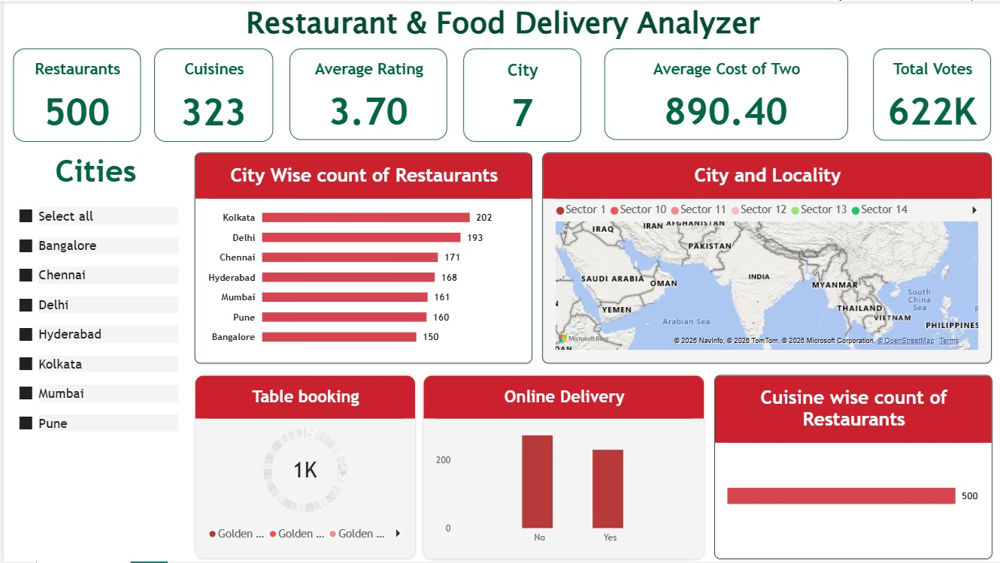

# Restaurant & Food Delivery Analyzer

## Overview
The **Restaurant & Food Delivery Analyzer** is a Power BI dashboard designed to provide comprehensive insights into the dining and food delivery landscape across major Indian cities. Built using a curated dataset of Zomato records, this interactive report allows stakeholders to analyze restaurant availability, customer engagement, pricing metrics, and operational features like table booking and online delivery adoption.

## Dashboard Metrics
The top-level KPI cards provide a quick snapshot of the overall market performance and scale:
* **Restaurants**: 500
* **Cuisines**: 323
* **Average Rating**: 3.70
* **Cities**: 7
* **Average Cost of Two**: 890.40
* **Total Votes**: 622K

## Key Visualizations & Features
* **Interactive City Slicer**: A clean, left-aligned filter panel allowing users to slice the data by 7 key Indian cities (Bangalore, Chennai, Delhi, Hyderabad, Kolkata, Mumbai, and Pune).
* **City Wise count of Restaurants**: A horizontal bar chart ranking cities by restaurant density, showing Kolkata leading with 202 restaurants, followed closely by Delhi with 193.
* **City and Locality Map**: A geospatial map visual plotting restaurant sectors and localities across the region.
* **Table booking**: A donut chart illustrating the distribution of restaurants that offer table booking services.
* **Online Delivery**: A comparative column chart tracking the count of restaurants that accept online delivery (Yes) versus those that do not (No).
* **Cuisine wise count of Restaurants**: A horizontal bar chart highlighting the most popular food categories and cuisines across the selected regions.

## Technical Details
* **Tool**: Microsoft Power BI Desktop
* **Data Source**: Microsoft Excel (`Delivery dataset.xlsx`) containing 500 cleaned records mapped across two relational sheets.
* **Core Techniques**: 
  * Power Query data transformation and cleaning.
  * Relational data modeling (linking primary restaurant data with city/pincode dimension tables).
  * DAX aggregations including Averages, Sums, and Distinct Counts to ensure accurate KPI rendering.
  * Geospatial mapping with enabled security settings for Bing Maps integration.

## Setup & Installation
1. Clone or download the repository containing `Restaurant & Food Delivery Analyzer.pbix` and `Delivery dataset.xlsx`.
2. Ensure both files are stored in the same local directory.
3. Open the `.pbix` file in Power BI Desktop.
4. If the visuals fail to load or prompt a file path error, click **Transform Data** on the Home ribbon to open the Power Query Editor.
5. Click **Data Source Settings**, select the existing Excel file path, click **Change Source**, and browse to select the `Delivery dataset.xlsx` file on your local machine.
6. Click **OK**, then **Close & Apply**.
7. Click **Refresh** on the Home ribbon to render all dashboard visuals
